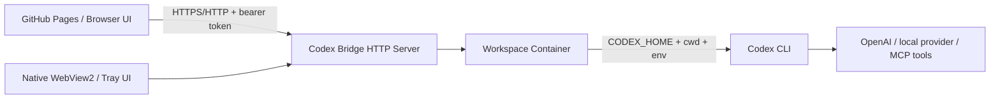
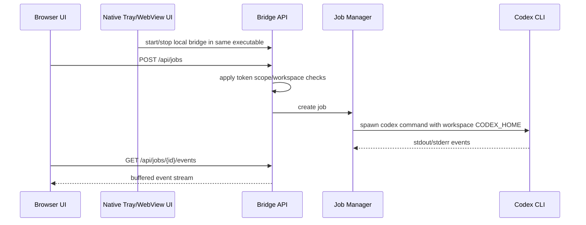

# Codex Bridge Architecture

Codex Bridge is split into four layers:

## Layers

1. Static UI in `docs/codex-ui/`, used both by GitHub Pages and the native shell.
2. Native Windows WebView2/tray executable built from `tools/codex_bridge_app.py`.
3. Local bridge server in `tools/wrapper_modules/codex_bridge/`.
4. Local state under `.codex-bridge/`.
5. Installed and already authenticated Codex CLI on the strong machine.

Weak LAN clients only run a browser. They do not install Codex, Python, Node, or
the workbench toolchain.

## Trust Boundaries

- Browser clients reach only the bridge API, never the Codex CLI directly.
- LAN browser clients must use bridge bearer tokens by default.
- Direct bridge-hosted `/ui` access from LAN clients is disabled by default;
  GitHub Pages hosts the client UI.
- Tokens are scoped by action (`read`, `run`, `admin`) and workspace id.
- Codex jobs run on the strong machine under the bridge process account.
- Workspace `CODEX_HOME` folders isolate Codex config/session state from each
  other and from the user's main Codex profile.
- Dangerous sandbox and raw Codex args are disabled unless explicitly enabled in
  local bridge config.

## Data Placement

Tracked:

- `docs/codex-ui/`
- `docs/codex-bridge.md`
- `docs/codex-bridge-openapi.json`
- `tools/wrapper_modules/codex_bridge/`
- `scripts/*codex-bridge*.ps1`

Local-only:

- `.codex-bridge/server.json`
- `.codex-bridge/tokens.json` when optional token auth is enabled
- `.codex-bridge/bootstrap-admin-token.txt` on every server start; the local UI reads this rotated admin token through loopback-only `/api/local-user-token`
- `.codex-bridge/workspaces/*`
- `.codex-bridge/jobs/*`
- `.codex-bridge/tls/*`
- `dist/codex-bridge.exe`

## Runtime Sequence

